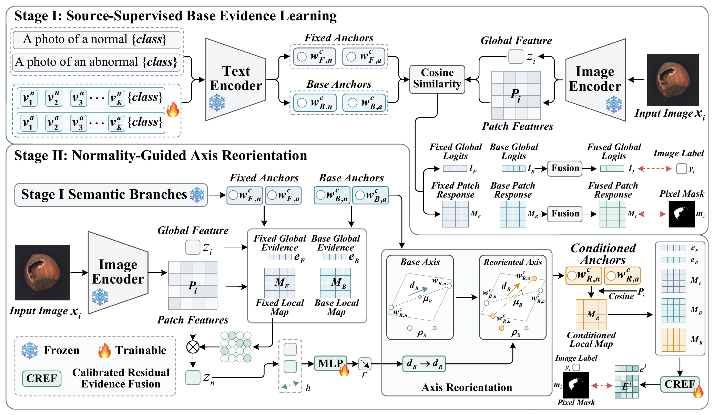

# ReAxis: Normality-Guided Reorientation of the Semantic Decision Axis for Zero-Shot Anomaly Detection

Research implementation associated with the manuscript by Haoran Gao, Yongzhen Huo, Yining Wang, Zhixiong Huang, Shenglan Liu, and Lin Feng.

<p align="center">
  <a href="docs/reaxis_framework.png"></a>
</p>
<p align="center"><em>Figure 2. Overview of ReAxis from the revised manuscript. Click the diagram to view it at full resolution.</em></p>

This release organizes the existing research code under the ReAxis names used in the revised manuscript. It retains the implementation's training and inference behavior. It is **not a verified reproduction of the manuscript's result tables**. The current code differs from the manuscript in calibration sharing, feature-layer usage, a visual pretraining dependency, training losses, and spatial pooling. Read [Manuscript alignment](docs/MANUSCRIPT_ALIGNMENT.md) before interpreting results.

The source distribution does not include the manuscript PDF, model weights, datasets, or private experiment logs.

## Method and code organization

ReAxis combines fixed semantic evidence, source-supervised base evidence, and query-conditioned local evidence. A normal context estimated from low-abnormality patches guides a bounded reorientation of the base normal-abnormal axis. Calibrated residual evidence fusion integrates the resulting evidence.

| Manuscript component | Public code entry |
| --- | --- |
| Stage I: Source-Supervised Base Evidence Learning | `train.py`, `stage_i_source_supervised_base_evidence_learning` |
| Stage II: Normality-Guided Axis Reorientation | `train.py`, `stage_ii_normality_guided_axis_reorientation` |
| Query-Derived Normal Context | `build_query_derived_normal_context` |
| Structure-Preserving Axis Reorientation | `StructurePreservingAxisReorientation` |
| Evidence Representation and Calibration | `EvidenceCalibrator` |
| Hierarchical Residual Fusion | `HierarchicalResidualFusion` |
| Global-Local Anomaly Prediction | `GlobalLocalAnomalyPrediction` |
| Stage II module collection | `ReAxisStageIIModules` |

Use `reaxislib` as the public import namespace. The implementation is retained in `adaptcliplib/reaxis.py` and related backbone/adapter files. `starcliplib`, historical HPRF/STAR-CLIP command aliases, and historical checkpoint keys remain for compatibility. Renaming a preset does not convert an old checkpoint into a different architecture.

## Installation

Use Python 3.10. Install `torch==2.4.1` and `torchvision==0.19.1` using the CPU or CUDA wheel distribution appropriate for your machine, then install the remaining dependencies from the repository root:

```bash
python -m pip install -r requirements.txt
```

Choose the CUDA build to match your environment; no CUDA wheel index is imposed by this repository. The examples below use the CLIP `ViT-L/14@336px` backbone. Obtain the pretrained backbone separately; it is not included in this distribution. Training at an input resolution of 518 with batch size 8 requires sufficient GPU memory.

## Data and the source-target protocol

Obtain MVTec AD and VisA from their providers and preserve their original layouts. The examples expect:

```text
data/
  mvtec/
    bottle/
      train/
      test/
      ground_truth/
    ...
  visa/
    split_csv/1cls.csv
    ...
```

Build metadata from the repository root:

```bash
python -m dataset.mvtec --root data/mvtec
python -m dataset.visa --root data/visa
```

Each command writes `meta.json` in the corresponding dataset root.

**Source supervision uses the source dataset's labeled evaluation pool.** In the inherited loader, `Dataset` reads `meta['test']` as its image/mask pool, including when called with `mode='train'`. For auxiliary-source training, this supplies normal and anomalous source images with masks; it is not the benchmark's normal-only unsupervised training protocol. The metadata key alone does not identify a held-out target evaluation set.

Keep source and target benchmarks disjoint. Train and, if needed, select checkpoints or hyperparameters using source data only. Never train on, adapt to, or select configurations using the target benchmark. For MVTec-to-VisA evaluation, all three training commands below use MVTec and only the final evaluation uses VisA. For the reverse direction, train a separate model on VisA and evaluate on MVTec.

The adapter-only ReAxis stages bypass target few-shot prompt-memory scoring. The inherited `k_shots` argument and prompt-dataset initialization remain in the loader/API; their presence does not establish a target few-shot ReAxis protocol. The examples retain the compatible default of 1 and do not use target reference features for prediction.

## Training the current implementation

The manuscript describes two stages. **This implementation additionally requires visual-adapter pretraining before Stage I**, because Stage I loads a visual checkpoint. The complete executable sequence is therefore visual pretraining, Stage I, then Stage II. This dependency is documented rather than removed in this release.

The following commands use MVTec as the source, 15 epochs per stage, seed 111, and the final checkpoint of each stage. These are runnable configuration examples, not a claim that the manuscript specifies 15 epochs or seed 111. Run them from the repository root in a shell supporting backslash line continuations.

Visual-adapter pretraining:

```bash
python train.py \
  --train_data_path data/mvtec --dataset mvtec \
  --train_stage stage1_fixed_anchor_visual \
  --source_validation_mode none \
  --pretrained_model 'ViT-L/14@336px' \
  --features_list 6 12 18 24 --image_size 518 --batch_size 8 \
  --learning_rate 0.001 --epoch 15 --seed 111 --save_freq 1 \
  --save_path checkpoints/mvtec/visual_pretrain
```

Stage I - Source-Supervised Base Evidence Learning:

```bash
python train.py \
  --train_data_path data/mvtec --dataset mvtec \
  --train_stage stage_i_source_supervised_base_evidence_learning \
  --stage1_checkpoint_path checkpoints/mvtec/visual_pretrain/epoch_15.pth \
  --source_validation_mode none \
  --pretrained_model 'ViT-L/14@336px' \
  --features_list 6 12 18 24 --image_size 518 --batch_size 8 \
  --learning_rate 0.001 --epoch 15 --seed 111 --save_freq 1 \
  --save_path checkpoints/mvtec/stage_i
```

Stage II - Normality-Guided Axis Reorientation:

```bash
python train.py \
  --train_data_path data/mvtec --dataset mvtec \
  --train_stage stage_ii_normality_guided_axis_reorientation \
  --reaxis_preset reaxis_full \
  --stage2_checkpoint_path checkpoints/mvtec/stage_i/epoch_15.pth \
  --source_validation_mode none \
  --pretrained_model 'ViT-L/14@336px' \
  --features_list 6 12 18 24 --image_size 518 --batch_size 8 \
  --learning_rate 0.001 --updater_lr 0.001 \
  --fusion_lr 0.0001 --calibration_lr 0.0001 \
  --stage_ii_updater_warmup_ratio 0.2 \
  --epoch 15 --seed 111 --save_freq 1 \
  --save_path checkpoints/mvtec/stage_ii
```

The expected final checkpoint is `checkpoints/mvtec/stage_ii/epoch_15.pth`. The explicit four-layer feature argument matches the manuscript's extraction setting, but the current branch scoring uses the last extracted layer; see the alignment document.

## Cross-domain evaluation

Evaluate the MVTec-trained model on VisA:

```bash
python test.py \
  --test_data_path data/visa --dataset visa \
  --train_stage stage_ii_normality_guided_axis_reorientation \
  --reaxis_preset reaxis_full \
  --checkpoint_path checkpoints/mvtec/stage_ii/epoch_15.pth \
  --pretrained_model 'ViT-L/14@336px' \
  --features_list 6 12 18 24 --image_size 518 --batch_size 8 \
  --seed 111 --aupro_num_thresholds 200 \
  --eval_metrics I-AUROC I-AP P-AUROC P-AUPRO \
  --save_path results/mvtec_to_visa
```

For VisA-to-MVTec, repeat all training steps with `--dataset visa`, `--train_data_path data/visa`, and a separate `checkpoints/visa` output tree. Then evaluate that source-trained Stage II checkpoint with `--dataset mvtec --test_data_path data/mvtec`. Do not reuse the MVTec-trained checkpoint to claim a held-out MVTec result.

## Evaluation and loss implementation notes

The public metric implementation was independently rewritten. The documented AUPRO configuration uses 200 thresholds, 8-connected ground-truth regions, and integration over false-positive rates up to 0.3, normalized by that range. Keep these settings with any reported results. They can differ from historical evaluation implementations or settings; this release does not guarantee numerical agreement with old logs or the manuscript tables.

`FocalLoss` was also independently rewritten using indexed probability selection. It retains the research implementation's default binary probability-input behavior and smoothing convention. This change is not an assertion that the full training procedure reproduces the manuscript.

Metrics are calculated on CPU. Undefined metrics appear as `null` in `metrics.json`; nonfinite model predictions raise an error. `--cpu_eva` additionally stores collected predictions on CPU. The evaluation command above requests four metrics; use `--eval_metrics` to request other supported image, pixel, or sample metrics.

Run the synthetic unit tests with `python -m pytest tests -q`. The release was checked with 81 passing CPU tests and one skipped CUDA-specific test, plus command-line import checks. These checks do not run dataset training or reproduce the manuscript tables.

## License and attribution

The release retains the GNU General Public License, version 2; see [LICENSE](LICENSE). This code builds on AdaptCLIP and includes or adapts components originating from OpenAI CLIP and OpenCLIP. Preserve the applicable upstream notices and licenses described in [THIRD_PARTY_NOTICES.md](THIRD_PARTY_NOTICES.md). The source-code license does not supply pretrained model weights or dataset permissions.
